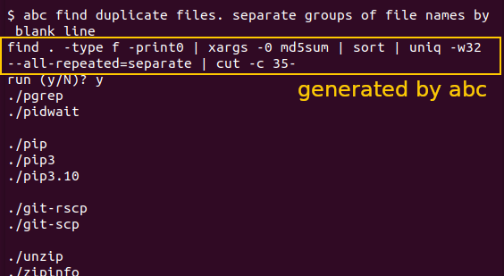

# abc (AI Bash Command)

## Synopsis

```
abc [OPTION]... DESCRIPTION...
```

## Description

abc uses a generative AI large language model to generate bash commands based on an English description provided by the user. The program takes the entire command line (excluding options) as the input description and returns bash command(s) that aim to accomplish the described task. The user is given the option to run the command(s).

Features

- Translates natural language descriptions into bash commands
- Configurable through a simple INI file
- Supports multiple configuration profiles
- Provides verbose and debug output options
- Prompts user before executing generated commands

## Options

- `--norun`: Do not run the commands and do not prompt
- `--run`: Run the commands without prompting [DANGEROUS!!]
- `-c, --config CONFIGFILE`: Path to the primary configuration file. (Defaults to $ABC_CONFIG or "$HOME/.abc.conf")
- `-s, --config-section SECTION`: Specifies the configuration section to be used. (Defaults to "default")
- `--quiet`: Suppresses all output except for errors and the generated commands.
- `--verbose`: Provides detailed information about the program's execution.
- `--debug`: Provides debug information. Only use this when troubleshooting issues.
- `--version`: Displays the program version and exits.

## Environment

- `ABC_CONFIG`: Specifies the path to the configuration file. If not set, the script will look for a file at '~/.abc.conf'.

## Configuration

abc reads configurations from a config file in the INI file format. Each section should include key-value pairs.

Example configuration file:

```ini
[default]
api_key = your_api_key_here

[project-2]
api_key = another_api_key_here
```

The program will attempt to read the config file from the first of these values provided:
1. `--config` command line option
2. $ABC_CONFIG environment variable
3. $HOME/.abc.conf

## Examples

To generate a bash command to list all PDF files in the current directory:

```
abc list all PDF files in the current directory
```

To use a specific project configuration:

```
abc -s project-2 --norun "create a new directory named 'test' and cd into it"
```

More complicated examples might take some trial and error to get the wording right:

```
abc find duplicate files. separate groups of file names by blank line
```



## Exit Status

- 0: Program executed successfully
- 1: An error occurred during execution

## TODO

- Support multiple LLM models
- Support multiple LLM providers
- Smarter prompts
- "please think about it step-by-step within <thinking></thinking> tags"
- LLM evaluation of response

## Contributing

Pull requests and bug reports are unlikely to be reviewed, incorporated, or fixed; but you are welcome to fork the project and publish updates.

## License

This project is licensed under the Apache 2 License - see the [LICENSE](LICENSE) file for details.

## Authors

Written by Claude 3.5 Sonnet
Prompt crafting by Eric Hammond

## Version

Current version: 2024-07-12
